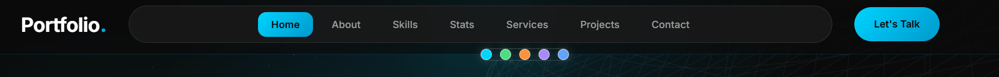
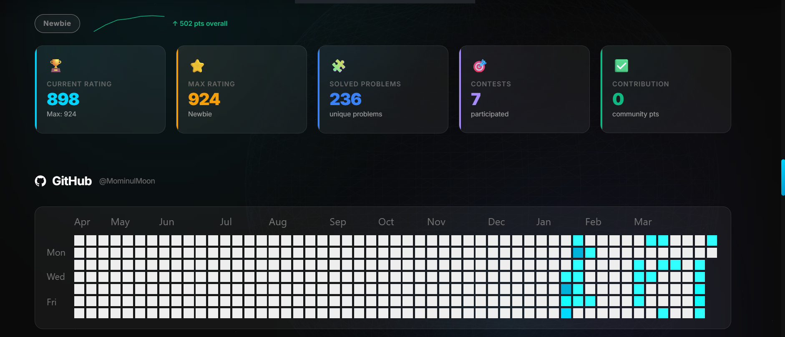
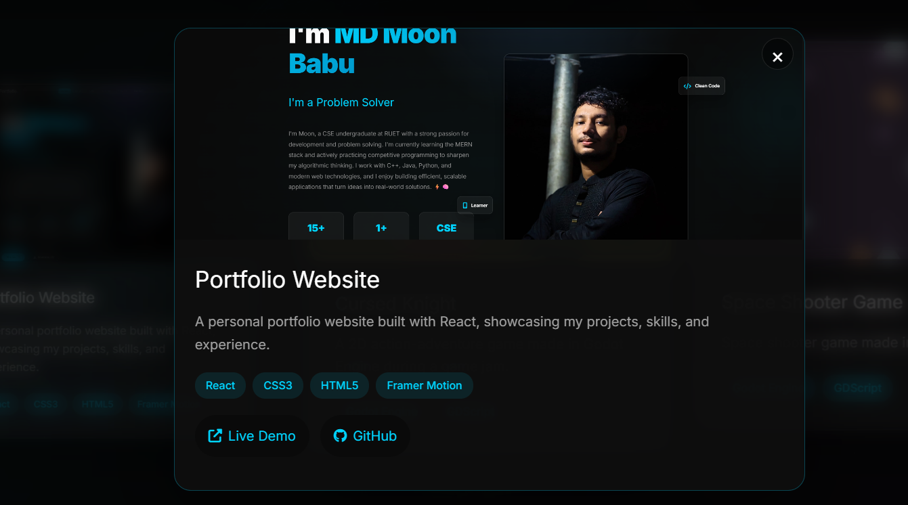
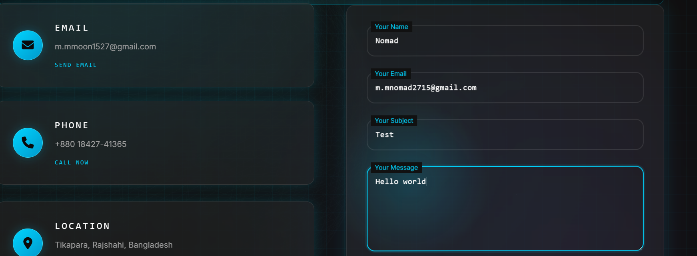

# MD Moon - Personal Portfolio

Interactive personal portfolio built with React + Vite, focused on smooth motion, a strong visual theme, and real portfolio utility (live stats, project details, direct messaging, and dynamic theming).

## Live Demo

[moonportfolio2715.netlify.app](https://moonportfolio2715.netlify.app/)

## Tech Stack

| Layer               | Tools                                                 |
| ------------------- | ----------------------------------------------------- |
| Frontend            | React 19, Vite 8                                      |
| Motion & UI effects | Framer Motion                                         |
| 3D visuals          | Three.js, `@react-three/fiber`, `@react-three/drei`   |
| Styling             | Tailwind CSS (utility classes) + custom CSS variables |
| Messaging           | EmailJS                                               |
| Data integrations   | Codeforces + GitHub stats widgets                     |
| Deployment          | Netlify                                               |

## Project Structure

```text
Portfolio/
├── public/
│   ├── CV.pdf
│   └── SVG.svg
├── src/
│   ├── assets/
│   ├── Components/
│   │   ├── Header.jsx            # sticky nav + mobile menu
│   │   ├── ThemePaletteBar.jsx   # theme color switch buttons
│   │   ├── ProfileCard.jsx       # hero/profile section
│   │   ├── About.jsx             # bio + interactive highlights
│   │   ├── Skill.jsx             # skills grid
│   │   ├── Stats.jsx             # Codeforces/GitHub live stats
│   │   ├── Services.jsx          # services cards
│   │   ├── Projects.jsx          # 3D project cards + expandable modal
│   │   ├── Contact.jsx           # retro contact section + EmailJS form
│   │   ├── Body.jsx              # composes the main sections
│   │   └── GalaxyBackground.jsx  # global 3D starfield
│   ├── App.jsx                   # top-level app composition + global effects
│   ├── usePortfolioLogic.js      # sticky header, smooth scroll, toasts, load logic
│   ├── themePalettes.js          # centralized theme palette definitions
│   ├── index.css
│   └── main.jsx
├── package.json
└── README.md
```

## Code Logic (High-Level)

1. `App.jsx` mounts global behavior, page sections, cursor glow, and theme defaults.
2. `usePortfolioLogic.js` runs DOM-level utilities (sticky header, smooth anchor scrolling, toasts, page fade-in).
3. `ThemePaletteBar.jsx` updates CSS variables through `themePalettes.js` to recolor the entire app.
4. Section components (`ProfileCard`, `About`, `Projects`, `Contact`, etc.) receive reveal/action helpers and render self-contained UI blocks.
5. `Projects.jsx` handles 3D hover + scroll depth effects and in-section expanded detail modal.
6. `Contact.jsx` manages EmailJS submission state (`idle`, `sending`, `success`, `error`) and displays feedback in the submit button.

## Feature Highlights

### 1) Change Color Palette

Switch among predefined themes to recolor accents, gradients, borders, and cursor glow in real time.



### 2) Live Stats (Codeforces + GitHub)

Displays active rating/contest/contribution metrics and GitHub activity heatmap.



### 3) Project Overview

Click project cards to open expanded overview with stack tags and quick links.



### 4) Send Direct Message

Visitors can send messages directly through the built-in EmailJS contact form.



## Useful Commands

```bash
# clone the repository
git clone https://github.com/MominulMoon/Portfolio.git

# move into project directory
cd Portfolio

# install dependencies
npm install

# start local dev server
npm run dev

# build for production
npm run build

# preview production build locally
npm run preview

# run lint checks
npm run lint
```

## Developer Info

| Field       | Value                                                  |
| ----------- | ------------------------------------------------------ |
| Name        | MD Moon Babu                                           |
| Degree      | B.Sc. in CSE (Running)                                 |
| University  | RUET (Rajshahi University of Engineering & Technology) |
| Location    | Tikapara, Rajshahi, Bangladesh                         |
| Focus Areas | MERN Stack, Data Science, Machine Learning             |

<b>Email </b> : m.mmoon1527@gmail.com

